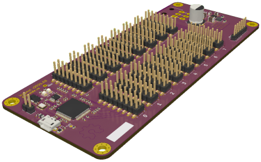
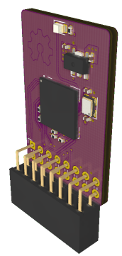

icepool-board
=============

KiCad 5 design files for the `icepool` project.

`icepool` is a FPGA cluster and development board.

Key features include,

- 16x headers for daughter boards.
- An FT2232H for USB communication and parallel FPGA flashing.
- One-to-many SPI interface for sending data from the PC to each daughter board.
- Daisy-chained SPI interface for passing data to and from the PC and each daughter board.
- A 6-pin ATX +12V power connector for use with conventional PC power supplies.

Currently, the project includes a daughter board design featuring a single [ice40hx8k-bg121](http://www.latticesemi.com/iCE40) FPGA with independent 1.2V LDO, 12MHz oscillator, and indicator LED.

## Dependencies

This project depends on the following KiCad libraries:

* [Digi-Key/digikey-kicad-library](https://github.com/Digi-Key/digikey-kicad-library)
* [jkiv/jkiv-kicad-library](https://github.com/jkiv/jkiv-kicad-library)

These repositories are set up as git submodules and can be cloned into `hardware/external/` using the following two commands:

    $ git submodule init
    $ git submodule update

## Drivers

See [jkiv/icepool-driver](https://github.com/jkiv/icepool-driver) project for a general-purpose Linux C library with Python3 bindings.

## Cores

* [jkiv/shapool-core](https://github.com/jkiv/shapool-core) - a SHA256d hashing core for cryptocurrency mining.

## Donate

Please consider supporting this project and others like it by donating:

* ☕: [ko-fi.com/jkiv_](https://ko-fi.com/jkiv_)
* ₿: `13zRrs1YDdooUN5WtfXRSDn8KnJdok4qG9`
