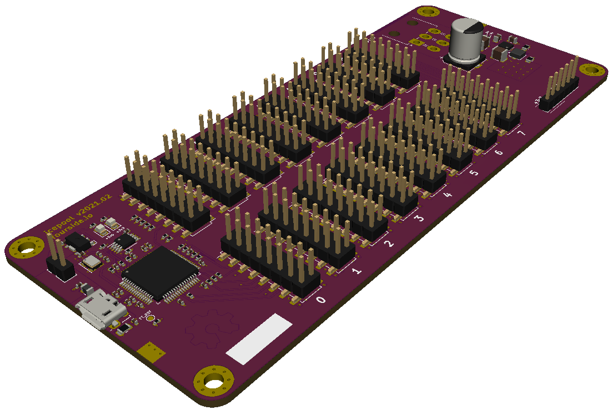

icepool-board
=============

## About

KiCad 5 design files for the *icepool* project.

*icepool* is a FPGA development board designed around Lattice ICE40 FPGAs.

Key features include,

- An ARM Cortex M0+ co-processor for serial communication, debugging, and FPGA flashing.
- One-to-many SPI interface for sending data from MCU to the FPGAs.
- Daisy-chained SPI interface for passing data to and from the MCU and each FPGA.

The goal is to produce an inexpensive, low-power, parallel co-processor for embedded computing projects.

Please consider supporting this project and others like it by donating:
* XBT: 13zRrs1YDdooUN5WtfXRSDn8KnJdok4qG9

## Dependencies

This project depends on the following KiCad libraries:

* [Digi-Key/digikey-kicad-library](https://github.com/Digi-Key/digikey-kicad-library)
* [jkiv/jkiv-kicad-library](https://github.com/jkiv/jkiv-kicad-library)

These repositories must be cloned into `hardware/external/`.

For example, starting at the repo root directory:

    $ cd hardware/external/
    $ git clone https://github.com/Digi-Key/digikey-kicad-library.git
    $ git clone https://github.com/jkiv/jkiv-kicad-library.git 
